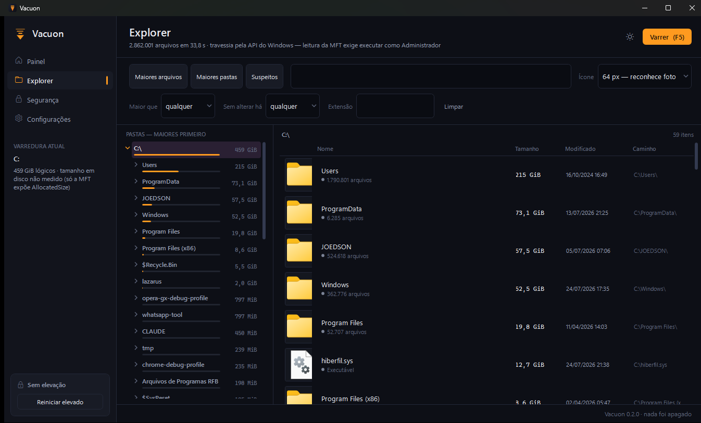
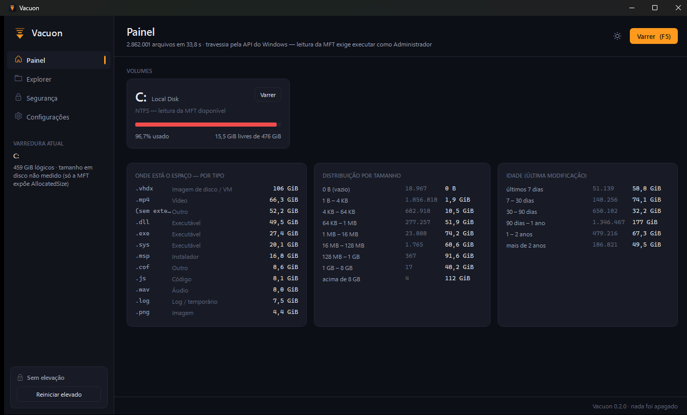
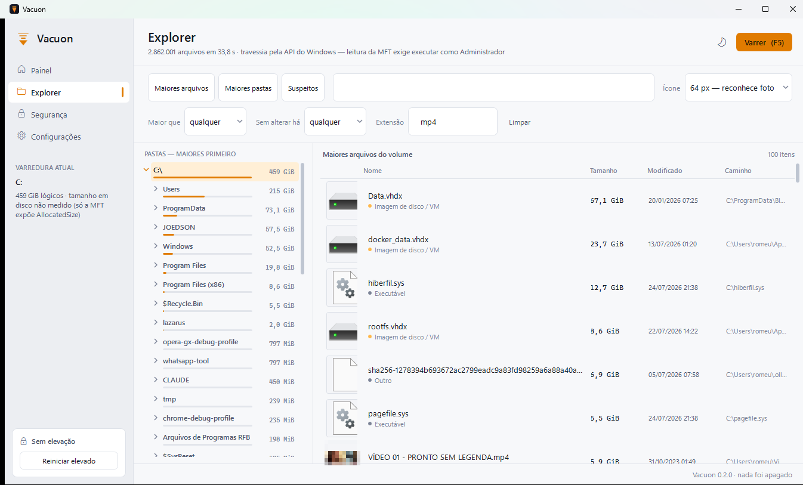
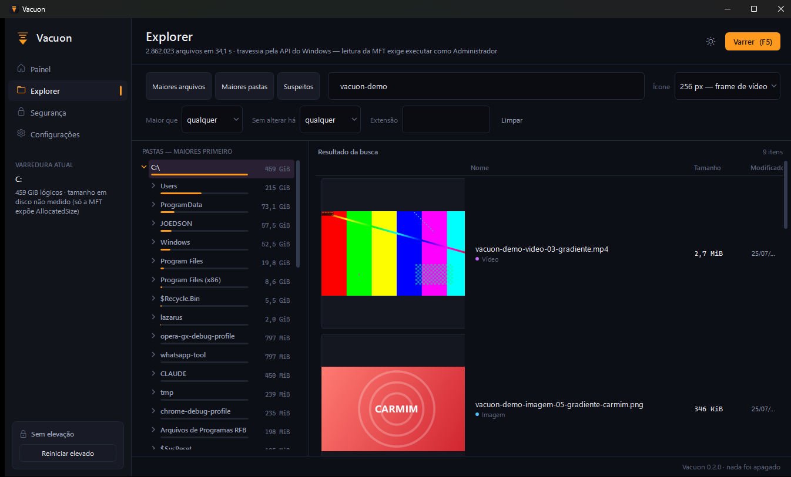
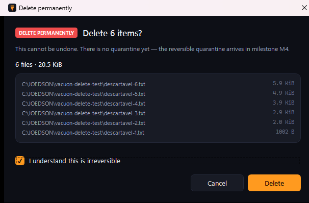
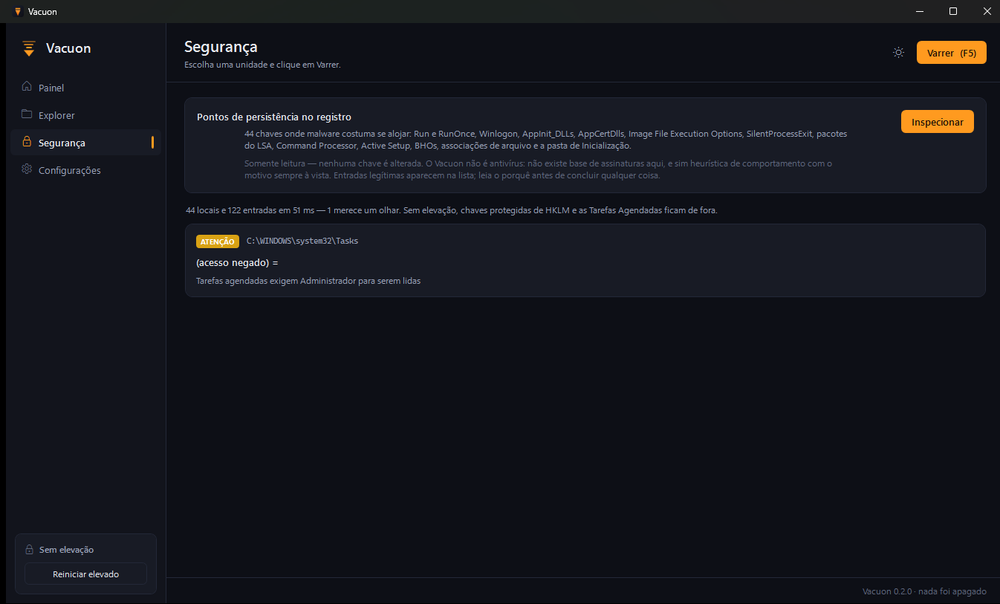
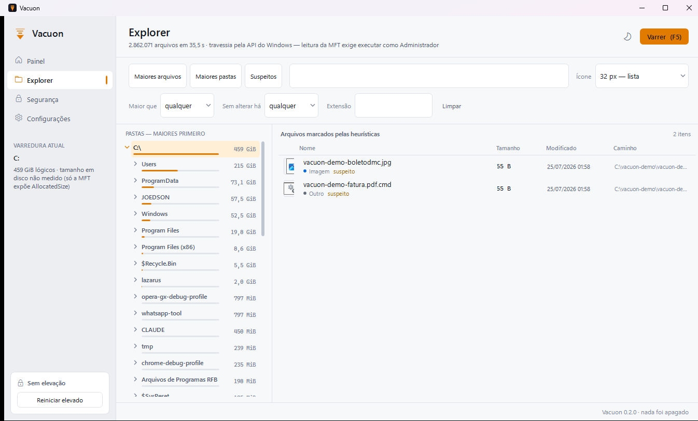
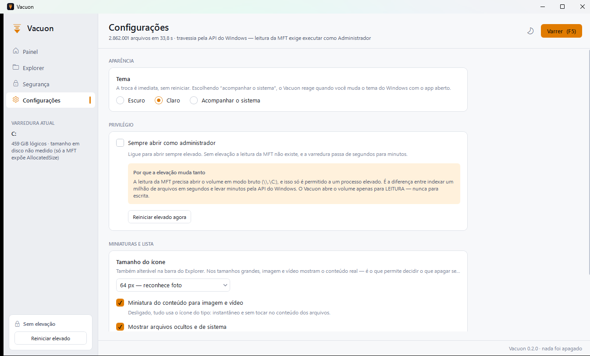

<div align="center">


# Vacuon

**Disk space analyzer for Windows.**
Reads the NTFS MFT straight off the volume, shows the real content of what you are about
to delete, and never claims a number it did not measure.

[](https://github.com/joedsonalves/vacuon/actions/workflows/ci.yml)
[](LICENSE)
[](https://dotnet.microsoft.com/)
[](#requirements)
[](tests)

**English** · [Português (Brasil)](README.pt-BR.md)



</div>

---

## What it is

Three questions, answered in seconds:

| | |
|---|---|
| **Where did my space go?** | Full map: biggest files, biggest folders, breakdown by type, size and age. |
| **What is safe to delete?** | Compound filters, forgotten files, and the cleanup rule catalog (M5). |
| **What *is* this thing?** | A thumbnail of the **actual content** — the video frame, the photo itself — in six sizes. |

And a fourth one that almost no disk utility answers: **is something odd taking root on my machine?**

> **v0.3.0 — milestones M1, M2 and deletion.** Vacuon measures, explains, shows — and now deletes, to the Recycle Bin by default and permanently only when you say so. The reversible quarantine of milestone M4 is still ahead, so the Recycle Bin is the only undo today, and the app says so where it matters. The full roadmap lives in [PRD.md](PRD.md) (written in Portuguese).

---

## The screens

> Screenshots are taken from real runs on a real machine. A few older ones are still in
> Portuguese; the language switch lives in Settings and English is the default.

### Dashboard — where the space is



One card per volume with a usage bar (red above 90%), plus three breakdowns that answer different questions:

- **by type** — on this machine, 9 `.vhdx` files add up to 106 GiB. Emulator and WSL virtual disks are the most common black hole and the most invisible one;
- **by size** — 4 files above 8 GB take 112 GiB, while 1.85 million files under 4 KB add up to 1.9 GiB. Answers in one glance whether the problem is "a few giants" or "many small ones";
- **by age** — 177 GiB have not been touched in over 90 days.

### Explorer — the working screen



Folder tree sorted **by size, not by name** — whoever opens the tree wants to find the culprit. The amber bar under each folder is the share of the disk that subtree occupies. Subfolders load on demand: the full hierarchy is never materialized.

Instant search over the in-memory index, plus filters for minimum size, age and extension. Buttons for **biggest files**, **biggest folders** and **suspicious**.

### Thumbnails — see before you delete



The reason this feature exists: deciding which of five 9 GB renders is the final one, **without opening any of them**.

Images and videos show their content; every other type shows its registered icon. Six sizes — 16, 32, 64, 128, 256 and 512 px — switchable from the Explorer toolbar or from Settings.

The "came from the content" label is a **verified fact**, not a guess: Vacuon asks for `SIIGBF_THUMBNAILONLY` first and only falls back to `SIIGBF_ICONONLY` when the Shell has no thumbnail. Without that split, a `.md` file with no preview handler would be announced as if the thumbnail were its content.

> The files in this screenshot are synthetic (ffmpeg's `smptebars` and `testsrc`, plus generated gradients), precisely so no one's content gets published.

### Deleting — Recycle Bin by default, permanent by choice



Multi-selection works on both panes: Ctrl-click and Shift-click in the file list, and a
checkbox per folder in the tree (a WPF TreeView has no multi-selection, and the checkbox
also makes the batch visible instead of something you hold Ctrl and hope for).

- **`Del`** → Recycle Bin. Recoverable, and the default everywhere.
- **`Shift+Del`** → permanent, gated behind an acknowledgement box.

Both modes plan first and show the plan: how many items, the total size, every path, and
which items the protection list refuses to touch. The shortcuts only fire while the list
or the tree has focus — `Del` must not delete files while you are editing the search box.

**Nothing overrides the protection list.** There is no flag, setting or argument that
unblocks the volume root, `%WINDIR%`, System32, the Program Files folders, well-known
profile folders, kernel-owned files (`pagefile.sys`, `hiberfil.sys`, `$MFT`), credential
stores, or Vacuon's own directory. Paths are canonicalized first, so `\?\C:\Windows`
and `C:\Windows\System32\..\System32` are caught too. The files *inside* a protected
folder are still deletable — you may well want to delete a 9 GB render sitting in Videos;
you must not be able to delete Videos itself.

This arrived before milestone M4, so **the Recycle Bin is currently the only undo**, and
the dialog says exactly that instead of implying a safety net that does not exist yet.

### Reopening — snapshot plus the change journal

The index is saved as a binary snapshot: a header, then the `FileEntry` array and the name
blob written as raw blocks. Loading is a block read plus a `MemoryMarshal.Cast` — no
per-entry parsing, no allocation per file. Serializing to JSON would have defeated the
point entirely: 2.8 million entries would cost more to parse than the traversal that
produced them.

On the next open, Vacuon asks NTFS **what changed** through the USN change journal instead
of walking the volume again. On an idle machine that is a handful of records.

The journal reports what changed but never **how big** anything became, so created and
modified files still need one size lookup each — deferred to the end, so a file written a
hundred times in the delta is measured once, at its final size.

**Every refusal is spelled out**, because they lead to different conclusions and only one
of them is something you can fix:

| Refusal | Meaning |
|---|---|
| no snapshot for this volume yet | first run |
| the snapshot is from another format version | `FileEntry` changed; reinterpreting old bytes as a new struct would produce a plausible-looking index full of garbage |
| the change journal was recreated | its numbering no longer matches ours |
| the change journal discarded the records we needed | it wrapped; the delta is unknowable |
| reading the change journal requires running as Administrator | **the actionable one** |

Snapshots are keyed by **volume serial, not drive letter** — letters get reassigned, and
reading D:'s index as E: would be worse than having none. `--fresh` forces a full scan.

> Like the MFT read, the journal needs elevation. Without it Vacuon writes no snapshot at
> all: an index with no journal position could never be brought up to date, so leaving one
> behind would only ever force a rescan while looking like a cache.

### Security — registry persistence points



44 keys where malware commonly takes root — `Run`, `RunOnce`, `RunOnceEx`, `Winlogon` (Shell, Userinit, Taskman, Notify), `AppInit_DLLs`, `AppCertDlls`, `BootExecute`, `Image File Execution Options\Debugger`, `SilentProcessExit`, LSA packages, `Command Processor\AutoRun`, `UserInitMprLogonScript`, Active Setup, BHOs, `SharedTaskScheduler`, file association hijacks, Startup folders and Scheduled Tasks.

**Read-only.** No key is modified, disabled or removed. And Vacuon is **not an antivirus**: there is no signature database here, only behavioural heuristics with the reason always in plain sight.

The screenshot above is the result on a clean machine: **44 locations, 122 entries, 51 ms, one single finding** — and it is a true one ("Scheduled Tasks require Administrator to be read"). Getting to that number took work; see [false positives are bugs](#false-positives-are-bugs).

### Suspicious — disguised files



Double extension (`invoice.pdf.cmd`), Unicode RLO character reversing the visible extension, hidden executable, executable carrying a large Alternate Data Stream, phishing extensions, executable recently created in System32.

The two items in the screenshot are synthetic decoys created to demonstrate the detection. Before calibration, this same list held **45 items, 43 of them false positives**.

### Settings — theme, language and privilege



**Light, dark, or following the system.** The switch is immediate, no restart, and in "follow" mode the app reacts when you change the Windows theme with it open. The title bar follows too (it is drawn by Windows, not by WPF — without handling that, the dark theme keeps a white strip at the top).

**English by default, Portuguese optional.** The switch is immediate as well: the UI strings live in the application resources and the language change rewrites them, the same mechanism the theme uses. Any string not translated yet falls back to English instead of showing a placeholder — a partial translation stays usable.

**Always run as administrator.** Turn it on and Vacuon relaunches elevated every time. The UAC prompt appears — and the app says so upfront instead of pretending it can be suppressed. It is worth it because **the MFT read only exists with elevation**: that is the difference between seconds and minutes.

---

## Why it exists

Existing tools pick a side: either they measure fast and do not clean (WizTree), or they clean and do not measure (CCleaner). None of them lets you **see the content** before deciding.

And none of them is honest with numbers. Vacuon is:

- **a hardlink counts once** — otherwise `WinSxS` would "take" three times its real size;
- **junctions are never traversed** — `C:\Documents and Settings` → `C:\Users` is an infinite loop;
- **logical size ≠ size on disk** — both are shown, labelled;
- **OneDrive placeholders are untouchable** — reading one *downloads* the file (filling the disk instead of freeing it) and deleting it removes it **from the cloud**;
- **whatever was not measured is reported as not measured.** This is the point: the Windows API traversal has no `AllocatedSize`, so Vacuon writes *"size on disk not measured"* instead of repeating the logical size and printing "wasted: 0 B". Look at the screenshots — that is exactly what the sidebar shows.

## Speed

The gain does not come from "more threads". It comes from **not using the Windows API**:

| Strategy | 1 M files | Requirements |
|---|---|---|
| **Raw MFT read** | **3–8 s** | NTFS + Administrator |
| USN + sizes on demand | 15–40 s | NTFS + Administrator |
| Parallel `FindFirstFileEx` | 60–200 s | any filesystem |
| Incremental update (USN) | **< 1 s** | previous snapshot |

The choice is automatic and cascades: without elevation or outside NTFS, Vacuon uses the API traversal and **says that it fell back, and why** — it is written in the header of every screenshot above.

**Measured on this machine** (2.86 M files, 459 GiB, SATA SSD): API traversal in **34 s** with a warm system cache, **4 min 33 s** cold, with the UI responsive throughout. The MFT read needs an elevated process.

## False positives are bugs

In the security module, a list that always alarms is a list the user learns to ignore. So a false positive here is treated as a **defect**, not as acceptable noise — and every fix became a positive plus a negative test.

Run against a real machine, the first version spat out 21 registry findings and 45 suspicious files. Today it is **1 and 2**. What was wrong:

| Naive signal | Why it was wrong |
|---|---|
| "binary without a digital signature" | Windows binaries are signed by **catalog** (`.cat`), not with a signature embedded in the PE. Demanding an embedded signature flagged `rundll32.exe`, `unregmp2.exe` and `ie4uinit.exe` |
| "the file it points to does not exist" | `msv1_0`, `scecli`, `{CLSID}` and `IEToEdge BHO` are **names**, not paths |
| "uses rundll32 (LOLBin)" | Windows' own Active Setup calls `rundll32` all the time. It only counts outside the system directory |
| "executable in a volatile folder: AppData\Local" | Chrome, Discord, Opera and Roblox **install there by default**. That was 4 false alarms on any machine |
| "orphaned autorun: `/UserInstall`" | A command-line switch is not a path. Normalizing `/` to `\` invented a file |
| "double extension: `Iterator.zip.js`" | It is a test file from the npm package `es-iterator-helpers`. Dependency trees were excluded |
| "double extension: `report.pdf.lnk`" | That is **exactly how Windows names a shortcut** to `report.pdf`. The Recent folder is full of them |
| "phishing extension: `Bubbles.scr`" | It is the screensaver that ships with Windows |

Two signals survive all of those exclusions, because they have no innocent explanation anywhere: the **RLO** character in a name, and an **executable recently created in System32**.

If Vacuon flags something legitimate on your machine, [open an issue](../../issues/new?template=falso-positivo.yml) — that template exists for nothing else.

## Installation

Grab the `.exe` from the [releases page](../../releases) — it is portable, runs from a USB stick, installs nothing.

Or build it:

```bash
git clone https://github.com/joedsonalves/vacuon.git
cd vacuon
dotnet build -c Release
dotnet test
```

### Requirements

- Windows 10 21H2+ or Windows 11 (x64 / ARM64)
- [.NET 10 Runtime](https://dotnet.microsoft.com/download)
- **Administrator** only for the MFT read. The app opens without UAC and asks for elevation only when you turn the option on in Settings.

## GUI and command line

The same core serves both. `Vacuon.exe` opens the interface; `vacuon.exe` is the CLI:

```bash
vacuon volumes                      # what exists and how full it is
vacuon scan C:                      # full volume map
vacuon scan "D:\Projects" --top=50  # folder scope
vacuon scan C: --suspicious         # also hunt for disguised files
vacuon security                     # registry persistence keys
vacuon thumb video.mkv --size=256   # extract the content thumbnail
vacuon reveal "C:\path\file.mp4"    # open Explorer with the file selected
vacuon scan C: --fresh              # ignore the snapshot, measure the disk again
vacuon scan C: --language=pt-BR     # output in Portuguese
```

<details>
<summary><b>Sample output — <code>vacuon scan C:</code></b></summary>

```
SCAN — C:
─────────
  Strategy          Windows API traversal
                    (fell back: reading the MFT requires running as Administrator)
  Time              4 min 33 s
  Files             2,861,572
  Folders           604,583
  Speed             10,477 files/s

  Logical size      459 GiB
  Size on disk      not measured (only the MFT read exposes AllocatedSize)
  Wasted            not measured for the same reason

BIGGEST FILES (top 5)
─────────────────────
      67.1 GiB  C:\ProgramData\BlueStacks_nxt\Engine\Pie64\Data.vhdx
      23.7 GiB  C:\...\AppData\Local\Docker\wsl\disk\docker_data.vhdx
      12.7 GiB  C:\hiberfil.sys
       8.6 GiB  C:\...\vm_bundles\claudevm.bundle\rootfs.vhdx
       6.9 GiB  C:\...\.ollama\models\blobs\sha256-1...

SIZE DISTRIBUTION
─────────────────
  1 B – 4 KB          1,856,643 files      1.9 GiB
  128 MB – 1 GB             367 files     91.6 GiB
  1 GB – 8 GB                17 files     48.2 GiB
  above 8 GB                  4 files      112 GiB
```

</details>

Exit codes: `0` success · `1` partial success · `2` bad argument · `3` needs elevation · `4` volume unreachable · `5` cancelled.

## Security and privacy

- **Not a single byte leaves the machine.** No server, no account, no telemetry, no automatic update check. Preferences live in `%AppData%\Vacuon\settings.json`.
- **The volume is opened read-only.** `GENERIC_READ`, never `GENERIC_WRITE`.
- **The registry scanner does not write.** Every key is opened with `writable: false`.
- **Nothing is executed.** Suspicious autoruns are displayed as text, never invoked.
- **There will never be "registry cleaning"**: zero space gained, high risk. It is in the [non-goals](PRD.md#32-não-objetivos-explicitamente-fora-do-escopo), along with system tweaks and "PC Health Score".

Details in [SECURITY.md](SECURITY.md).

## Milestones

| Milestone | What it delivers | Status |
|---|---|:-:|
| M0 | Solution, UI-free core, tests | ✅ |
| M1 | Raw MFT read, index, fallback traversal, CLI | ✅ |
| M1b | Registry persistence scanner + suspicious files | ✅ |
| M1c | Shell thumbnails in six sizes | ✅ |
| **M2** | **GUI: dashboard, virtualized explorer, search, light/dark themes, elevation, i18n** | ✅ |
| **M1d** | **Binary snapshot + incremental USN update** | ✅ |
| M3 | Embedded player (LibVLCSharp) and media preview | ⬜ |
| M2b | Multi-select delete: Recycle Bin, permanent, protected-path list | ✅ |
| M4 | Reversible quarantine, history, undo | ⬜ |
| M5 | Catalog of 120+ cleanup rules | ⬜ |
| M6 | Exact and near duplicates | ⬜ |
| M7 | Treemap | ⬜ |

## Architecture

```
src/
├─ Vacuon.Native/   Win32 P/Invoke + NTFS on-disk parser
│  ├─ Interop/      VolumeDevice · Shell32 · Gdi32 · Kernel32
│  └─ Ntfs/         MftRecordParser · DataRunList · MftStream · UsnJournal
├─ Vacuon.Core/     UI-FREE core — CLI, tests and GUI all consume this
│  ├─ Index/        FileEntry (64 bytes) · NameBlob · VolumeIndex · IndexSnapshot
│  ├─ Scan/         ScanOrchestrator · MftScanner · Win32Walker · VolumeProbe
│  │                IncrementalUpdater (snapshot + USN delta)
│  ├─ Analyzers/    SizeAnalyzer · FileCategories
│  ├─ Actions/      DeleteService (Recycle Bin · permanent · dry-run)
│  ├─ Safety/       ProtectedPaths — the list nothing overrides
│  ├─ Security/     RegistryPersistenceScanner · SuspiciousFileAnalyzer
│  ├─ Localization/ L (en-US base + optional pt-BR, embedded JSON)
│  └─ Preview/      ThumbnailProvider · BmpWriter
├─ Vacuon.App/      WPF — hand-written MVVM, no external dependency
│  ├─ Themes/       Dark.xaml · Light.xaml · Controls.xaml
│  ├─ ViewModels/   MainViewModel · FileRowViewModel · FolderNodeViewModel
│  └─ Views/        Dashboard · Explorer · Security · Settings
└─ Vacuon.Cli/      subcommands scan/volumes/security/thumb/reveal
```

The index is made of **flat `struct` arrays**, not an object graph: 1 million files = **64 predictable MB**, with no per-file heap object. A `class FileNode` graph with `Parent`/`Children` would cost ~400 MB and keep Gen2 suffering for the whole scan. The `FileEntry_IsExactlySixtyFourBytes` test exists so nobody touches that contract by accident — it is what pushed the Alternate Data Stream bytes into a side table, since ADS is rare and a field on every entry would store zeros.

The hierarchy uses a child index in **CSR** form (two `int[]`, like a sparse matrix): ~23 MB for 2.8 million entries, against hundreds of MB for a `Dictionary<int, List<int>>`.

Localization keys are **stable identifiers**, not display text: `FileCategories.Of()` returns `category.video`, and only `DisplayName()` resolves it. That way colors, comparisons and tests never depend on which translation is loaded.

## Traps this code already solves

If you are going to write an MFT reader, or themes and i18n in WPF, these cost real time:

1. **The MFT is fragmented.** Reading it as one contiguous block works on a fresh disk and **silently loses files** on a used one. Decoding record 0's data runs is mandatory.
2. **Update Sequence Array fixups.** Without applying them, the last two bytes of every sector come back wrong — the parser "almost works", which is worse than failing.
3. **`FSCTL_ENUM_USN_DATA` does not return size.** Whoever builds the pipeline on it rewrites it later.
4. **8.3 names duplicate entries.** A file with a long name has two `$FILE_NAME` attributes; counting both doubles the volume's file count.
5. **`MAX_PATH`.** Above 260 characters every Win32 call needs the `\\?\` prefix — and deep `node_modules` is exactly where that hurts.
6. **`LibraryImport` does not marshal COM interfaces** (SYSLIB1052) and **does not append the W suffix**: `GetObject` must be `GetObjectW`.
7. **`ProgressBar.Value` binds TwoWay by default** and throws on a read-only property.
8. **A `Style` with `TargetType="CheckBox"` applied to a `RadioButton`** brings the window down while the XAML loads.
9. **The default `ComboBox` template ignores `Background`** — in the dark theme it renders white. It needs its own template, and so does `ProgressBar` (its animated glow reads as a whitish bar over a dark background).
10. **The title bar belongs to Windows.** Without `DwmSetWindowAttribute(DWMWA_USE_IMMERSIVE_DARK_MODE)`, the dark theme keeps a white strip at the top.
11. **`GridViewRowPresenter` requires a `GridView`.** Reusing a column-based `ListView` row style in one without a `View` makes the item simply not render.
12. **`SHFILEOPSTRUCT.pFrom` is a double-null-terminated list**, not a string. One terminator silently truncates the batch.
13. **`Path.GetFullPath("C:")` returns the process's current directory on C:**, not the root — a drive spec without a separator is drive-*relative*. As a deletion target that is a trap, so `C:` is read as the volume root and refused.
14. **`FSCTL_READ_USN_JOURNAL` is `METHOD_NEITHER`,** which is why its control code ends in `0xBB` and not `0xB8`. A wrong code fails with a generic "invalid function".
15. **A USN file reference is not an MFT record number.** The high 16 bits are the sequence number; using the whole 64-bit value as an array index would be catastrophic.
16. **`ListView.SelectedItems` is not a bindable dependency property.** Multi-selection has to be pushed to the view model from code-behind.
17. **A resource named `Strings.en-US.json` is turned into a satellite assembly.** It matches the `name.culture.extension` pattern, so MSBuild infers the culture and ships the file to `bin\en-US\*.resources.dll` instead of the main assembly. The build succeeds, `GetManifestResourceStream` returns null, and the whole UI renders as `[key]`. `WithCulture="false"` is mandatory — there is a test guarding it.

The full list lives in [PRD §17](PRD.md#172-armadilhas-técnicas-aprender-aqui-não-em-produção).

## Contributing

Read [CONTRIBUTING.md](CONTRIBUTING.md). In short: `Vacuon.Core` never references UI, `Safety/` and `Actions/` require 100% coverage, and **no change may make the app claim a number it did not measure**.

## License

[MIT](LICENSE).

---

<div align="center">
<sub>The name comes from vacuum — the space that becomes yours again.</sub>
</div>
